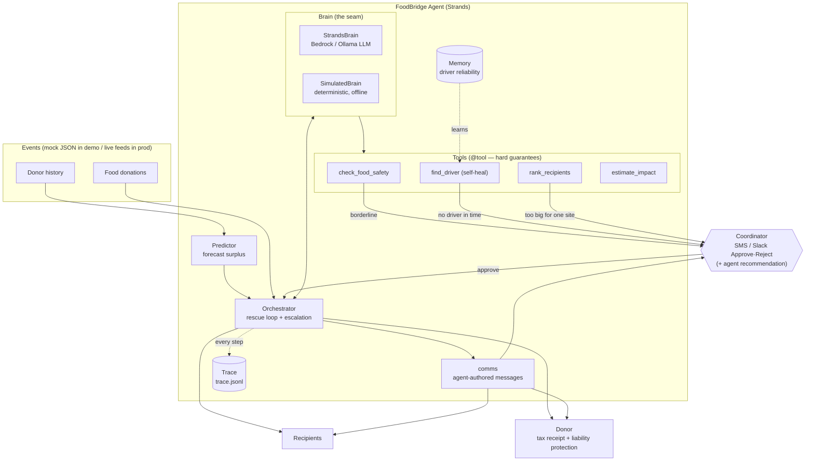

# FoodBridge — Architecture

FoodBridge is a **Strands agent** with a deliberately split brain: a language model supplies
judgment and communication, while deterministic **tools** enforce the things that must be
guaranteed (food-safety rules, fairness, impact math). An orchestrator runs the autonomous
rescue loop and surfaces a decision to a human only when it must. It is built to run unattended
on **Amazon Bedrock AgentCore Runtime**.

## System diagram



## The autonomous loop (per donation)

```
Forecast → Scout → Safety → Match → Dispatch → Deliver → Receipt → Impact
                      |         |         |
                   escalate  escalate  escalate    <- human pinged ONLY here,
                                                       always with a recommendation
```

## Why the brain is split

- **Tools are deterministic.** Whether food is safe, whether a site is served fairly, and how
  many meals a rescue equals must be *guaranteed* — so they are code, exposed to the agent as
  Strands `@tool` functions.
- **The model supplies judgment.** Which eligible recipient to choose, whether a borderline
  case truly needs a human, and how to phrase a message to a tired volunteer — these benefit
  from a language model.
- **Fallback everywhere.** Every model call degrades to the deterministic `SimulatedBrain`, so
  the product never sends a blank message or stalls on a flaky model. This is also what makes
  the whole system runnable, and fully testable, offline at $0.

## Components

| Component | File | Responsibility |
|---|---|---|
| Orchestrator | `foodbridge/orchestrator.py` | Runs the loop; decides when to escalate |
| Brain (seam) | `foodbridge/brain.py` | `SimulatedBrain` + `StrandsBrain`; judgment + language |
| Tool surface | `foodbridge/tools.py` | `@tool` functions the LLM calls |
| SDK layer | `foodbridge/strands_agent.py` | SDK detection + model providers (bedrock/ollama/litellm) |
| Predictor | `foodbridge/predictor.py` | Proactive surplus forecasting from history |
| Safety | `foodbridge/safety.py` | safe / escalate / reject verdict |
| Matcher | `foodbridge/matcher.py` | Ranks recipients; explains the pick |
| Dispatcher | `foodbridge/dispatcher.py` | Assigns a driver; self-heals on decline |
| Comms | `foodbridge/comms.py` | Messages to drivers / donors / recipients / coordinator |
| Receipts | `foodbridge/receipts.py` | Tax receipt + Good Samaritan liability note |
| Impact | `foodbridge/impact.py` | Meals / money / CO2 accounting |
| Reporting | `foodbridge/reporting.py` | Self-written impact report |
| Memory | `foodbridge/memory.py` | Learns driver reliability across runs |
| Observability | `foodbridge/observability.py` | Structured JSONL decision trace |
| Dashboard / Serve | `foodbridge/dashboard.py`, `serve.py` | Animated UI + local server |
| CLI | `foodbridge/cli.py` | demo / serve / ask / forecast / check / test |

## Strands + AgentCore mapping

- `tools.py` exposes capabilities as Strands `@tool`s. `make_decision_tools()` binds
  `check_food_safety`, `rank_recipients`, `estimate_impact`, and `consult_guidelines` (RAG)
  to the live recipient roster and a mutable time context, and `StrandsBrain` gives them to a
  Strands `Agent` (`BedrockModel` or `OllamaModel`). For each donation the **model itself
  decides which tools to call** and in what order, then returns its choice — a genuine
  tool-calling loop, not a fixed script.
- **Agentic RAG** (`knowledge.py` + `data/knowledge/`): a curated food-safety & donation-law
  knowledge base (USDA danger zone, Good Samaritan Act, Big-9 allergens, date labels,
  cold-chain, prepared food, tax rules). The agent retrieves passages via
  `consult_guidelines`, escalations carry a **[Grounding: …]** citation, and `ask` answers
  rules questions with sources. Retrieval is dependency-free lexical ranking; swapping in
  vector embeddings (Bedrock Titan / Ollama) is a one-function change.
- Every tool call the agent makes is written to the decision trace (`tool_call` steps), so the
  agent's reasoning is auditable — the same idea as Strands/OpenTelemetry observability.
- The deterministic safety and ranking logic stay authoritative in the orchestrator; the agent
  reasons through the *same* tools. The LLM is never the sole arbiter of food safety.
- `strands_agent.py` isolates all SDK-dependent code, so the offline demo never breaks.
- **AgentCore:** `agentcore_app.py` wraps the orchestrator in an AgentCore Runtime entrypoint;
  put the per-donation loop on a schedule to run continuously in the background — the literal
  expression of the theme ("runs autonomously… surfaces only on a real decision").
